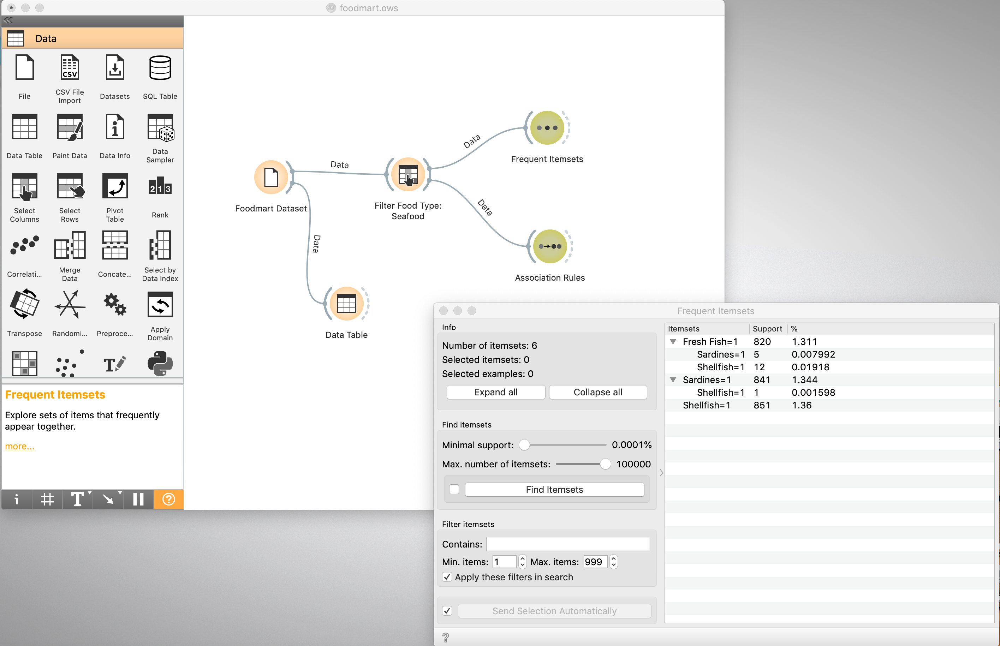
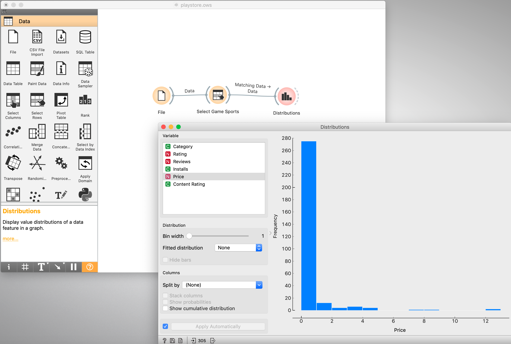
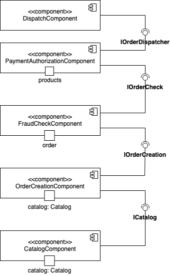
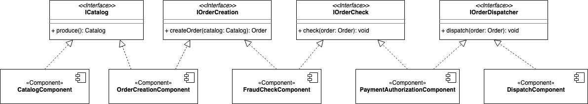

# Lab01 - Data Flow

Estrutura de pastas:

~~~
├── README.md  <- arquivo apresentando a tarefa
│
├── images     <- arquivos de imagens usadas no documento
│
└── orange     <- arquivos do Orange
~~~

# Projeto Orange / Regras de Associação para Foodmart

## Imagem do Projeto

## Arquivo do Projeto
[Foodmart OWS](orange/foodmart.ows)

# Projeto Orange / Análise de Dados do Google PlayStore

## Imagem do Projeto

## Arquivo do Projeto
[Playstore OWS](orange/playstore.ows)

## Projeto de Composição de Componentes para Recomendação

## Diagrama de Componentes

## Diagrama de Interfaces

