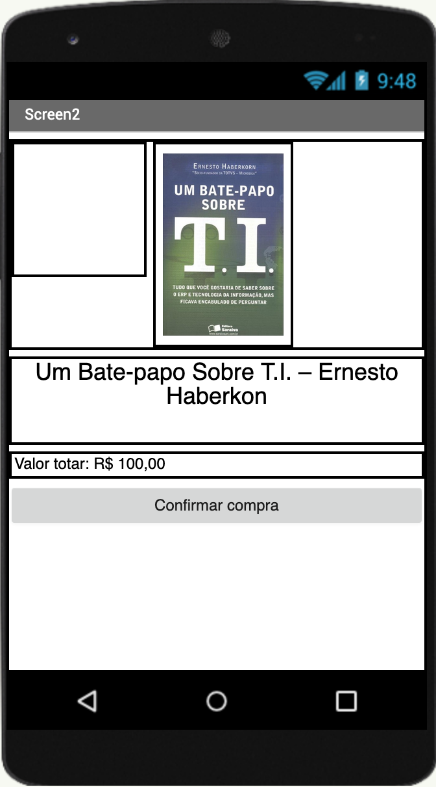

# Modelo para Apresentação do Lab03 - Model-View-Controller

Estrutura de pastas:

~~~
├── README.md  <- arquivo apresentando a tarefa
│
├── images     <- arquivos de imagens usadas no documento
│
└── app        <- aplicativo exportado em formato `aia`
~~~

## Tarefa 1
> Coloque a imagem do PRNG do seu diagrama como ilustrado abaixo:
> 
> 

## Tarefa 2
> Coloque a imagem do PNG do seu diagrama como ilustrado abaixo:
>

>
> Nesta tarefa não há um diagrama de atividades. O leilão é um processo que emerge da interação dos componentes. Liste a seguir qual a sequência esperada de ações que emergirá da interação como uma lista. Quando ser referir a uma mensagem, indique o tópico/interface envolvido. Exemplo:
> 1. o componente X posta uma mensagem com o tópico Y;
> 2. os componentes do tipo A que assinam o tópico X fazem Z e postam uma mensagem com o tópico W.

## Tarefa 3
> Coloque as imagens PNG da captura de quatro telas do seu aplicativo:
> * tela 1 - nenhum produto selecionado

> * tela 2 - primeiro produto selecionado

> * tela 3 - segundo produto selecionado

> * tela 4 - compra de um dos produtos efetiva

> * tela 5 - diagrama de blocos do aplicativo

>
> As telas devem ser apresentadas conforme exemplos a seguir.
> 
> Exemplo de uma tela do aplicativo:
>

>
> Exemplo de uma tela do diagrama de blocos:
>

[Arquivo AIA](aplicativo.aia)
