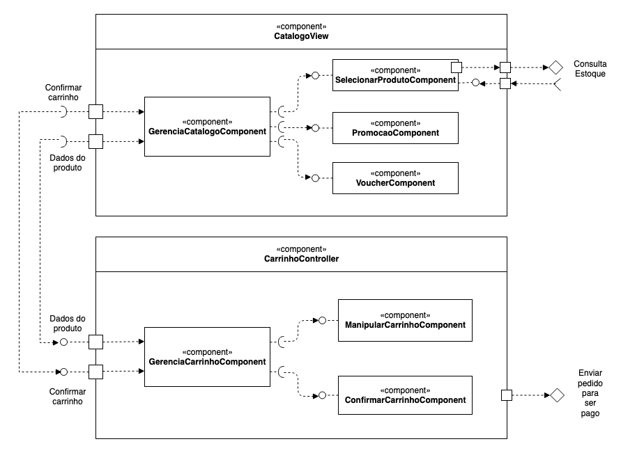

# Lab05 - Subcomponentes e Páginas Dinâmicas

Estrutura de pastas:

~~~
├── README.md  <- arquivo apresentando a tarefa
│
└── images     <- arquivos de imagens usadas no documento
~~~

## Tarefa 1
 

## Tarefa 2
Link para o projeto no Codepen: [React 03 - Componente Barra](https://codepen.io/santanche/pen/KKzmbwR)

> Coloque o código do seu componente:
>
**HTML**
~~~html

~~~

**CSS**
~~~css
.carro {
  width:100px;
  display:inline-block;
}

.carro img {
  width:100%;
  height: auto;
}

.carro span {
  font-weight: bold;
  font-size: 20px;
}
~~~

**JavaScript**
~~~javascript
class Carro extends React.Component {
  render() {
    return 

      
      {this.props.nome}
      
;
  }
}

const elemento = 

                   <h2>Carro Importados</h2>
                   <Carro nome="Ferrari" imgSrc="https://s2.glbimg.com/bS7gv8nR9OuyA_m14nH_2BG-DfE=/512x320/smart/e.glbimg.com/og/ed/f/original/2020/05/30/ferrari_f8_tributo.jpg"/>
                           <Carro nome="Lamborghini" imgSrc="https://hips.hearstapps.com/hmg-prod.s3.amazonaws.com/images/2020-lamborghini-huracan-evo-104-1576597210.jpg?crop=0.889xw:1.00xh;0.111xw,0&resize=640:*"/>
                 

ReactDOM.render(elemento, 
        document.getElementById("root"));

~~~
